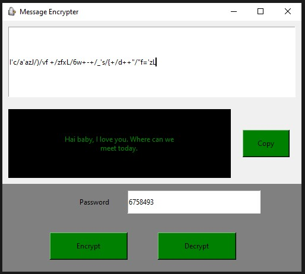

# Simple_Message_Encrypter


## Introduction
A simple message encrypter for you. The program code is added on February 14th 2021. As the date represents, it is mainly for the couples out there, to have a secure communication. Most of the daily usage applications like Whatsapp, Snapchat, Instagram, etc.. claims to provide encrypted messaging. But this encryption won't hide your messages from your parents and friends. In this situation, my Simple_Message_Encrypter can help you. This will help you to encrypt the message with a password.

## SENDER's side
1) Enter the message that you want to send
1) Encrypt it with a password
1) Click on the encrypt button
1) Copy the encrypted message
1) Open your favourite messaging application
1) Paste the copied text and send

## RECEIVER's side
1) Copy the message that you got from the sender
1) Paste it in the Simple_Message_Encrypter
1) Ask the sender for the password
1) Enter the password
1) Click on Decrypt button

## Getting started
In order to run this script, you need to have Python and pip installed on your system. After you're done installing Python and pip, run the following command from your terminal to install the requirements from the same folder (directory) of the project.
```
pip install -r requirements.txt
```

After satisfying all the requirements for the project, Open the terminal in the project folder and run
```
python encrypter.py
```
or
```
python3 encrypter.py
```
depending upon the python version. Make sure that you are running the command from the same virtual environment in which the required modules are installed.


\
Now you are all set to explore the Simple_Message_Encrypter. Happy Hacking!!!!!!


## Reporting Bugs
Feel free to report any buys or issues at the below github profile.
Check out my Github profile [a-k-r-a-k-r](https://github.com/a-k-r-a-k-r)
